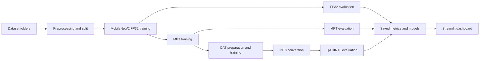

# Crop Disease Detection using MobileNetV2, Mixed Precision Training, and QAT

This project is a deep learning based crop disease detection system. It trains a transfer learning model on crop leaf images, compares a baseline FP32 model with Mixed Precision Training (MPT), applies Quantization-Aware Training (QAT), converts the trained model toward an INT8 deployment format, and exposes the final results through a Streamlit dashboard with image upload, camera input, predictions, confidence scores, and disease recommendations.

The project focuses on both accuracy and deployment readiness. The training pipeline saves model artifacts, evaluation metrics, per-class performance, model sizes, latency values, and a summary that is consumed by the dashboard.

## Project Objectives

- Detect crop diseases from leaf images.
- Use a pretrained MobileNetV2 model for transfer learning.
- Compare FP32 training with Mixed Precision Training.
- Apply Quantization-Aware Training and INT8 conversion for deployment experiments.
- Measure accuracy, macro F1 score, latency, model size, and training time.
- Provide a Streamlit interface for testing images and viewing model outcomes.
- Add treatment, prevention, and symptom recommendations for predicted diseases.

## Key Outcomes

The saved experiment results show strong classification performance across the trained crop disease classes.

| Model | Accuracy | Macro F1 | Latency |
| --- | ---: | ---: | ---: |
| FP32 baseline | 95.32% | 0.9505 | 14.30 ms/image |
| Mixed Precision Training | 96.05% | 0.9454 | 12.57 ms/image |
| QAT/INT8 pipeline | 96.10% | 0.9467 | 12.65 ms/image |

Model size comparison:

| Artifact | Size |
| --- | ---: |
| `outputs/model_fp32.pth` | 8.79 MB |
| `outputs/model_mpt.pth` | 8.79 MB |
| `outputs/model_int8.pth` | 8.77 MB |

Training time comparison:

| Training mode | Time |
| --- | ---: |
| FP32 | 1725.46 seconds |
| MPT | 1655.20 seconds |

Main observations:

- Mixed Precision Training improved accuracy from 95.32% to 96.05%.
- The QAT/INT8 pipeline achieved the best saved accuracy at 96.10%.
- MPT reduced measured inference latency compared with FP32 in the saved evaluation.
- INT8 artifact size is only slightly smaller in this run, because the conversion code includes a fallback path when full static quantized kernels are unavailable.
- No unseen dataset result is recorded because `dataset_unseen` was not present during the saved run.
- K-fold validation support exists in the code, but it was not enabled for the saved result.

## Dataset

The project uses an image folder dataset located in `dataset/`. Each folder name is treated as one class using `torchvision.datasets.ImageFolder`.

Total classes: 15  
Total images: 20,639  
Default split: 80% training and 20% testing  
Approximate training samples: 16,511  
Approximate testing samples: 4,128

Class distribution:

| Class | Images |
| --- | ---: |
| `Pepper__bell___Bacterial_spot` | 997 |
| `Pepper__bell___healthy` | 1478 |
| `Potato___Early_blight` | 1000 |
| `Potato___Late_blight` | 1000 |
| `Potato___healthy` | 152 |
| `Tomato_Bacterial_spot` | 2127 |
| `Tomato_Early_blight` | 1000 |
| `Tomato_Late_blight` | 1909 |
| `Tomato_Leaf_Mold` | 952 |
| `Tomato_Septoria_leaf_spot` | 1771 |
| `Tomato_Spider_mites_Two_spotted_spider_mite` | 1676 |
| `Tomato__Target_Spot` | 1404 |
| `Tomato__Tomato_YellowLeaf__Curl_Virus` | 3209 |
| `Tomato__Tomato_mosaic_virus` | 373 |
| `Tomato_healthy` | 1591 |

## Project Structure

```text
CropDisease_MPT_QAT/
+-- app.py
+-- main.py
+-- requirements.txt
+-- README.md
+-- Crop_Disease_Project_Presentation.pptx
+-- dataset/
+-- deployment/
|   +-- convert_int8.py
+-- models/
|   +-- mpt_model.py
|   +-- qat_model.py
+-- outputs/
|   +-- evaluation_details.json
|   +-- model_fp32.pth
|   +-- model_int8.pth
|   +-- model_mpt.pth
|   +-- summary.json
|   +-- summary.txt
+-- utils/
    +-- evaluate.py
    +-- preprocess.py
    +-- train.py
```

## Technology Stack

- Python
- PyTorch
- TorchVision
- MobileNetV2
- CUDA AMP autocast and GradScaler for mixed precision training
- PyTorch quantization APIs for QAT and INT8 conversion
- Streamlit for the dashboard
- PIL/Pillow for image handling

The code checks Python version at runtime and is intended for Python 3.10 to Python 3.13. It blocks Python 3.14 because the local PyTorch setup is not available for that version.

## Model Architecture

The model is defined in `models/mpt_model.py`.

- Base architecture: `torchvision.models.mobilenet_v2`
- Weights: ImageNet pretrained weights using `weights="DEFAULT"`
- Final classifier layer replaced with:

```python
nn.Linear(1280, num_classes)
```

This makes the model suitable for the 15 crop disease classes in the dataset.

## Data Preprocessing

Preprocessing is implemented in `utils/preprocess.py`.

Training transforms:

- Random resized crop to 224 x 224
- Random horizontal flip
- Random vertical flip
- Random rotation
- Color jitter
- Random affine shear
- Tensor conversion
- ImageNet normalization

Evaluation and inference transforms:

- Resize to 256
- Center crop to 224 x 224
- Tensor conversion
- ImageNet normalization

The project also uses a `WeightedRandomSampler` during training. This helps reduce the effect of class imbalance, especially because some classes have many more images than others.

## Training Pipeline

The main pipeline is implemented in `main.py`.

Pipeline steps:

1. Load dataset from `dataset/`.
2. Split the dataset into train and test samples.
3. Train a baseline FP32 MobileNetV2 model.
4. Evaluate the FP32 model and save `outputs/model_fp32.pth`.
5. Continue training using the same training function with AMP autocast and GradScaler, representing the MPT experiment.
6. Evaluate the MPT model and save `outputs/model_mpt.pth`.
7. Apply Quantization-Aware Training using `models/qat_model.py`.
8. Convert the QAT model using `deployment/convert_int8.py`.
9. Evaluate the QAT/INT8 model and save `outputs/model_int8.pth`.
10. Optionally evaluate an unseen dataset if `dataset_unseen/` is available.
11. Optionally run stratified K-fold validation.
12. Save summaries and detailed metrics in the `outputs/` folder.

High-level workflow:



## Mixed Precision Training

Mixed Precision Training is implemented in `utils/train.py` using:

- `torch.cuda.amp.autocast`
- `torch.cuda.amp.GradScaler`

This allows supported operations to run in lower precision while keeping important values stable in FP32. The goal is faster training and lower memory usage on compatible CUDA hardware, while maintaining model accuracy.

Note: the current `train_model` helper uses AMP internally. The pipeline labels the first saved artifact as FP32 because it is the baseline full-precision model artifact, then continues training and evaluates it as the MPT experiment.

## Quantization-Aware Training and INT8 Conversion

QAT setup is implemented in `models/qat_model.py`.

The code:

- Selects a supported quantized backend.
- Prefers `fbgemm` when available.
- Applies PyTorch's default QAT configuration.
- Prepares the model with `torch.ao.quantization.prepare_qat`.

INT8 conversion is implemented in `deployment/convert_int8.py`.

The conversion step:

- Moves the model to CPU.
- Attempts static quantization conversion.
- Runs a test forward pass to verify quantized execution.
- Falls back to dynamic quantization on linear layers if static quantized convolution support fails.

This fallback keeps the pipeline reliable even on systems where full quantized kernels are not available.

## Evaluation

Evaluation is implemented in `utils/evaluate.py`.

The evaluator reports:

- Accuracy
- Latency per image
- Confusion matrix
- Per-class precision
- Per-class recall
- Per-class F1 score
- Macro F1 score

Quantized models are evaluated on CPU because quantized kernels in this pipeline are CPU-oriented.

## Per-Class MPT Results

The following table shows the saved per-class results for the MPT model.

| Class | Precision | Recall | F1 Score | Support |
| --- | ---: | ---: | ---: | ---: |
| `Pepper__bell___Bacterial_spot` | 0.9261 | 0.9760 | 0.9504 | 167 |
| `Pepper__bell___healthy` | 0.9217 | 0.9935 | 0.9562 | 308 |
| `Potato___Early_blight` | 0.9810 | 1.0000 | 0.9904 | 207 |
| `Potato___Late_blight` | 0.9802 | 0.9519 | 0.9659 | 208 |
| `Potato___healthy` | 0.9565 | 0.5789 | 0.7213 | 38 |
| `Tomato_Bacterial_spot` | 0.9155 | 0.9926 | 0.9525 | 404 |
| `Tomato_Early_blight` | 0.9934 | 0.8065 | 0.8902 | 186 |
| `Tomato_Late_blight` | 0.9638 | 0.9540 | 0.9589 | 391 |
| `Tomato_Leaf_Mold` | 0.9854 | 0.9951 | 0.9902 | 204 |
| `Tomato_Septoria_leaf_spot` | 0.9595 | 0.9595 | 0.9595 | 346 |
| `Tomato_Spider_mites_Two_spotted_spider_mite` | 0.9813 | 0.9375 | 0.9589 | 336 |
| `Tomato__Target_Spot` | 0.9207 | 0.9239 | 0.9223 | 289 |
| `Tomato__Tomato_YellowLeaf__Curl_Virus` | 0.9937 | 0.9753 | 0.9844 | 647 |
| `Tomato__Tomato_mosaic_virus` | 1.0000 | 1.0000 | 1.0000 | 72 |
| `Tomato_healthy` | 0.9615 | 1.0000 | 0.9804 | 325 |

Classes with relatively lower F1 scores in the saved MPT run:

| Class | F1 Score | Support |
| --- | ---: | ---: |
| `Potato___healthy` | 0.7213 | 38 |
| `Tomato_Early_blight` | 0.8902 | 186 |
| `Tomato__Target_Spot` | 0.9223 | 289 |

The lower score for `Potato___healthy` is likely affected by low test support compared with other classes.

## Streamlit Dashboard

The dashboard is implemented in `app.py`.

Dashboard features:

- Shows FP32, MPT, and QAT/INT8 accuracy.
- Shows FP32 and INT8 model sizes.
- Shows compression ratio.
- Shows FP32 and MPT training time.
- Displays model comparison tables and charts.
- Loads saved metrics from `outputs/summary.json`.
- Loads detailed evaluation from `outputs/evaluation_details.json`.
- Loads a trained model from `outputs/model_mpt.pth` or `outputs/model_fp32.pth`.
- Allows image upload using JPG, JPEG, or PNG.
- Allows camera capture using Streamlit camera input.
- Predicts the crop disease class.
- Shows top 3 predictions with confidence.
- Supports an unknown threshold for low-confidence predictions.
- Supports forced prediction mode.
- Displays disease symptoms, treatment, and prevention recommendations.

The app labels predictions as `Unknown / Out of Dataset` when confidence is below the selected threshold and forced prediction mode is disabled.

## Recommendation System

The recommendation logic is inside `app.py`.

It maps known disease names to:

- Symptoms
- Treatment
- Prevention

Covered disease groups include:

- Healthy leaves
- Bacterial spot
- Early blight
- Late blight
- Leaf mold
- Septoria leaf spot
- Target spot
- Mosaic virus
- Yellow leaf curl virus

If a class does not match a known mapping, the app returns a general recommendation asking the user to confirm with a local agronomy expert and maintain sanitation, crop rotation, and regular monitoring.

## Output Files

The training pipeline creates these files in `outputs/`:

| File | Purpose |
| --- | --- |
| `summary.json` | Machine-readable summary used by the Streamlit app |
| `summary.txt` | Human-readable project summary |
| `evaluation_details.json` | Accuracy, macro F1, latency, confusion matrix, and per-class metrics |
| `model_fp32.pth` | Saved FP32 model weights |
| `model_mpt.pth` | Saved MPT model weights |
| `model_int8.pth` | Saved INT8 or fallback quantized model |

## How to Run

Create and activate a virtual environment:

```powershell
py -3.10 -m venv .venv
.\.venv\Scripts\Activate.ps1
```

Install the main dependencies:

```powershell
pip install -r requirements.txt
```

For the Streamlit dashboard, also install:

```powershell
pip install streamlit pillow
```

Run the full training pipeline:

```powershell
python main.py --force-run
```

Run the pipeline using cached results if `outputs/summary.json` already exists:

```powershell
python main.py
```

Run with optional unseen dataset evaluation:

```powershell
python main.py --force-run --unseen-dir dataset_unseen
```

Run with optional K-fold validation:

```powershell
python main.py --force-run --run-kfold --kfolds 5
```

Start the dashboard:

```powershell
streamlit run app.py
```

## Important Notes

- The dataset must follow ImageFolder format, where every class is a separate folder inside `dataset/`.
- The dashboard expects `outputs/summary.json` to exist. Run `python main.py --force-run` at least once if the summary is missing.
- The app loads `outputs/model_mpt.pth` first, then falls back to `outputs/model_fp32.pth`.
- Python 3.10 to 3.13 is recommended for this project.
- The existing `requirements.txt` pins only `torch` and `torchvision`; Streamlit and Pillow are also needed to run the dashboard.
- Quantized model behavior can depend on CPU backend support.

## Limitations

- The saved run does not include unseen dataset evaluation because no `dataset_unseen/` folder was available.
- K-fold validation code exists but was not run for the saved output.
- `Potato___healthy` has far fewer images than most other classes, which affects reliability for that class.
- INT8 model size reduction was minimal in the saved run.
- The recommendation system is rule based and should not replace expert agricultural diagnosis.
- The model is trained on the provided dataset classes, so unrelated images may produce low-confidence or incorrect predictions.

## Future Improvements

- Add more images for low-support classes such as `Potato___healthy`.
- Add a separate unseen validation dataset to measure generalization.
- Run full K-fold validation and report average accuracy and macro F1.
- Improve INT8 deployment using a target environment with stable static quantized kernel support.
- Add Grad-CAM or heatmap visualization to explain model predictions.
- Add more disease-specific recommendation mappings.
- Package the dashboard for deployment on a local server or cloud platform.

## Conclusion

This project successfully builds a complete crop disease classification workflow. It covers dataset preprocessing, transfer learning with MobileNetV2, mixed precision training, QAT/INT8 deployment experimentation, detailed evaluation, saved model artifacts, and a practical Streamlit interface for image-based disease prediction.

The best saved accuracy is 96.10% from the QAT/INT8 pipeline, while the MPT model provides strong accuracy and lower measured latency compared with the FP32 baseline. The final dashboard makes the trained system usable for testing leaf images and viewing actionable disease guidance.
